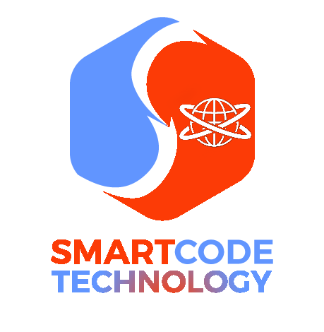

# SmartCode Technology

## Office Log

### 1st Task: Build Office Site

#### Day 1
* Created skype ID.
* Researched single page office sites.
* Chose a frontpage image.
* Built a fixed navbar.

#### Day 2
* Added new front page.
* Added separate `mixins` and `variables` from `style.scss`.
* Added **ABOUT** section.
* Added **SERVICES** section.

#### Day 3
* Added **WHY CHOOSE US** in **SERVICES** section.
* Added **CONTACT** section.  
* Added **FOOTER** section.
* Added **Drawer** (*responsive navbar*). 

#### Day 4 
* Added transition to *Navbar*, *logo*.
* Changed responsive navbar styles.   
* Changed *Frontpage-bg*, *footer* (styles and structure).
* Went through React Redux tutorial
